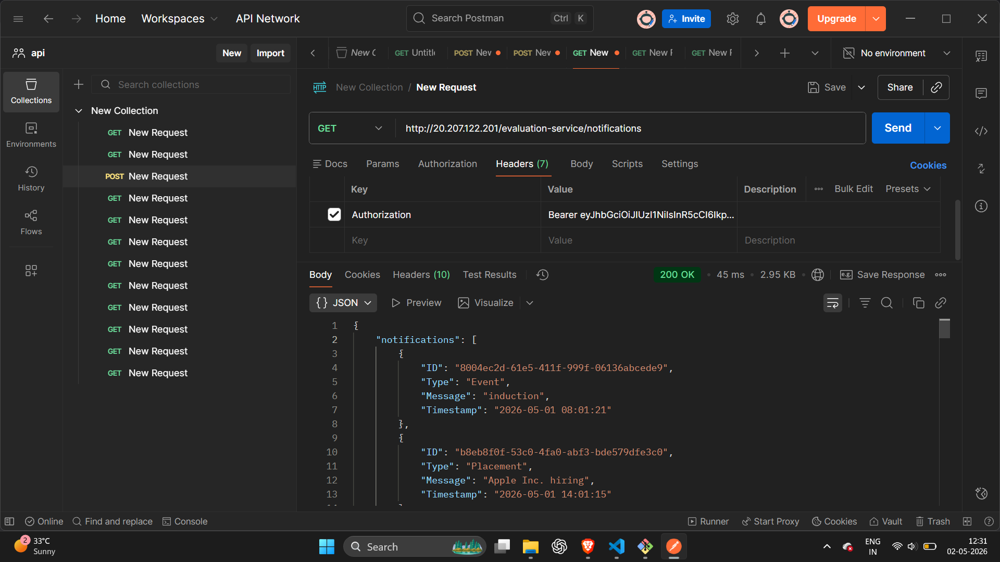
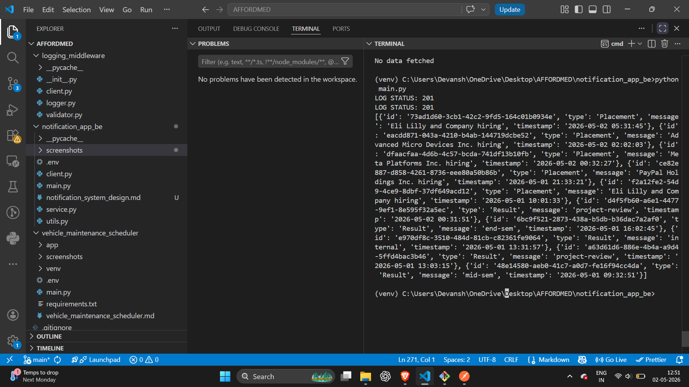

# Notification System Design

---

## Stage 1: API Design

### 1. Get Notifications

Endpoint: GET /notifications?userId=123

Response:
{
"notifications": [
{
"id": "uuid",
"type": "Placement",
"message": "Company X is hiring",
"isRead": false,
"createdAt": "2026-05-02T10:00:00"
}
]
}

---

### 2. Mark Notification as Read

Endpoint: PATCH /notifications/{id}

Request:
{
"isRead": true
}

Response:
{
"success": true
}

---

### 3. Create Notification

Endpoint: POST /notifications

Request:
{
"userId": 123,
"type": "Event",
"message": "Hackathon starting soon"
}

Response:
{
"id": "generated-uuid"
}

---

### Real-Time Notification Mechanism

* Use WebSockets for real-time updates
* Server pushes notifications instantly
* Fallback: polling every 30 seconds

---

## Stage 2: Database Design

### Choice: PostgreSQL

Reason:

* Structured data
* Strong consistency
* Easy indexing

---

### Schema: notifications

Columns:

* id (UUID, Primary Key)
* userId (INT)
* type (ENUM: Event, Result, Placement)
* message (TEXT)
* isRead (BOOLEAN)
* createdAt (TIMESTAMP)

---

### Scaling Problems

* Large table size
* Slow queries on filtering

---

### Solutions

* Index on (userId, isRead, createdAt)
* Pagination (LIMIT, OFFSET)
* Table partitioning for large data

---

## Stage 3: Query Optimization

Given Query:
SELECT * FROM notifications
WHERE studentID = 1042 AND isRead = false
ORDER BY createdAt DESC;

---

### Issues

* Full table scan
* Returns unnecessary columns
* No index usage

---

### Optimized Query

SELECT id, message, type, createdAt
FROM notifications
WHERE userId = 1042 AND isRead = false
ORDER BY createdAt DESC
LIMIT 20;

---

### Index Strategy

Composite Index:
(userId, isRead, createdAt DESC)

---

### Why Not Index Every Column?

* Slows down inserts/updates
* Consumes extra memory
* Not all indexes are useful

---

### Additional Query

Find students with placement notifications in last 7 days:

SELECT userId
FROM notifications
WHERE type = 'Placement'
AND createdAt >= NOW() - INTERVAL '7 days';

---

## Stage 4: Performance Optimization

Problem:
Database overloaded due to frequent reads

---

### Solutions

1. Redis Caching
2. Pagination (limit results)
3. Lazy loading
4. Read replicas
5. Push-based updates (WebSockets)

---

### Trade-offs

* Cache may become stale
* Replicas introduce eventual consistency
* More complexity in system design

---

## Stage 5: Reliability Improvements

Given Flow:
send_email → save_to_db → push_to_app

---

### Problems

* If email fails, system becomes inconsistent
* No retry mechanism
* Tight coupling

---

### Improved Design

Use Message Queue (Kafka / RabbitMQ)

Flow:

1. Save notification to DB
2. Push event to queue
3. Worker services process:

   * email sending
   * push notifications

---

### Benefits

* Retry mechanism
* Fault tolerance
* Scalable architecture

---

## Stage 6: Priority Notification Logic

Goal:
Return top 10 most important notifications

---

### Priority Rules

1. Placement > Result > Event
2. Newer notifications > Older ones

---

### Approach

* Assign weights:
  Placement = 3
  Result = 2
  Event = 1

* Sort by:
  (priority DESC, createdAt DESC)

* Return top 10

---

## Tech Stack

* Python
* Requests
* REST APIs
* PostgreSQL (design level)
* Redis (conceptual)
* Kafka/RabbitMQ (conceptual)

---

## Notes

* Logging middleware integrated across services
* Authentication handled via headers
* Fail-safe logging implemented
* Clean JSON responses ensured

---

## 📸 Screenshots

### 1. Notifications API Response

* Endpoint: `/notifications`
* Method: GET

---

### 2. Stage 6 Output (Top 10 Notifications)

* Processed using priority logic
* Sorted by type and timestamp

