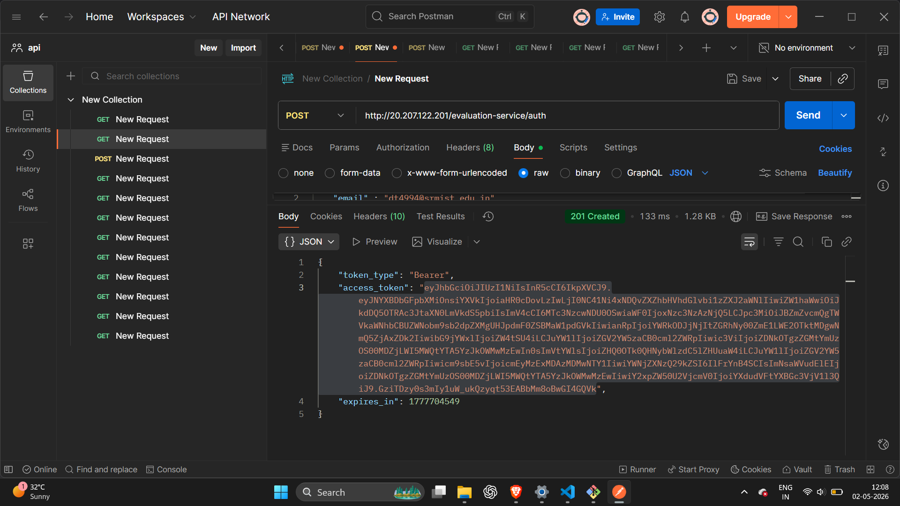
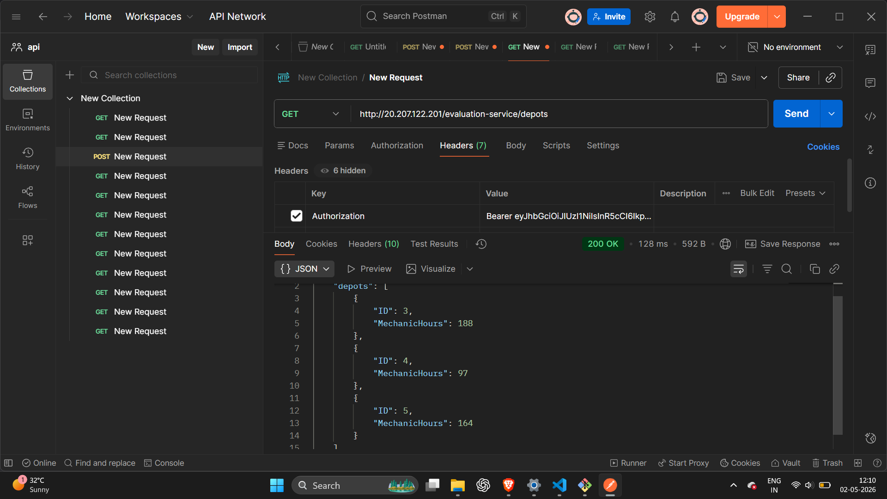
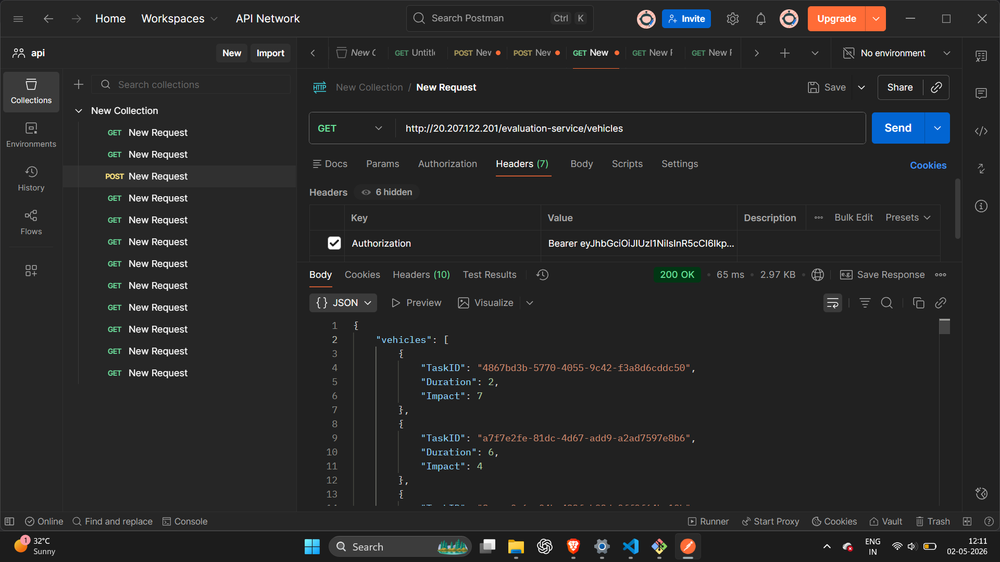
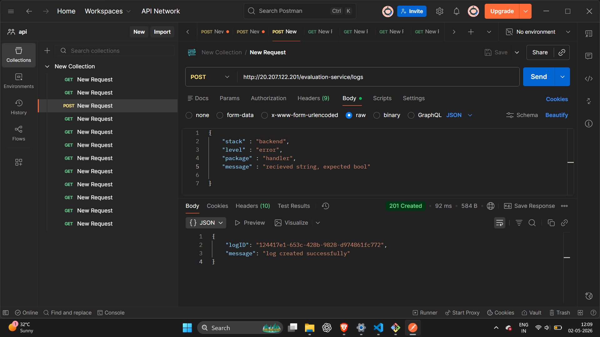
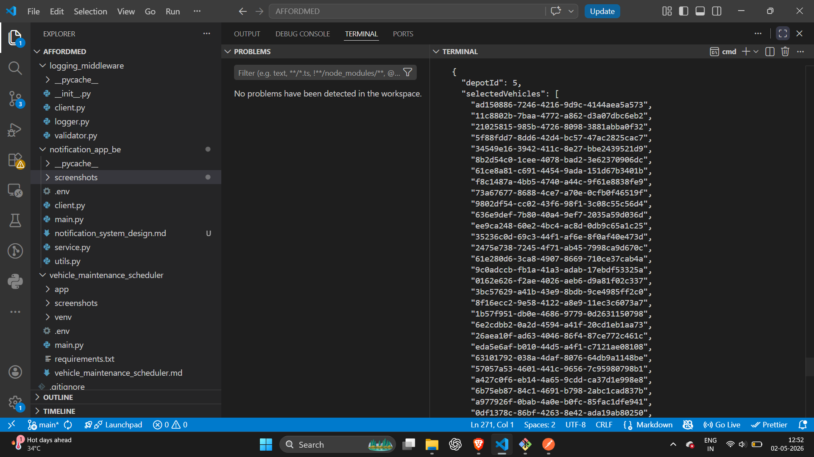
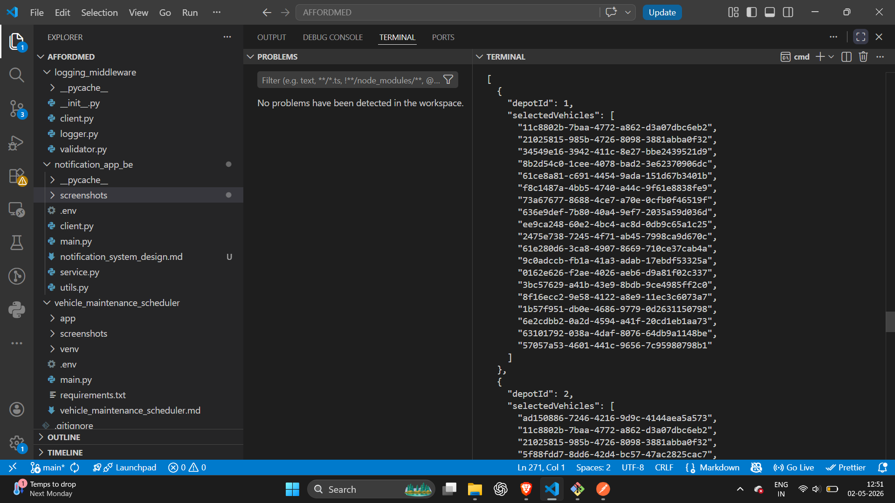
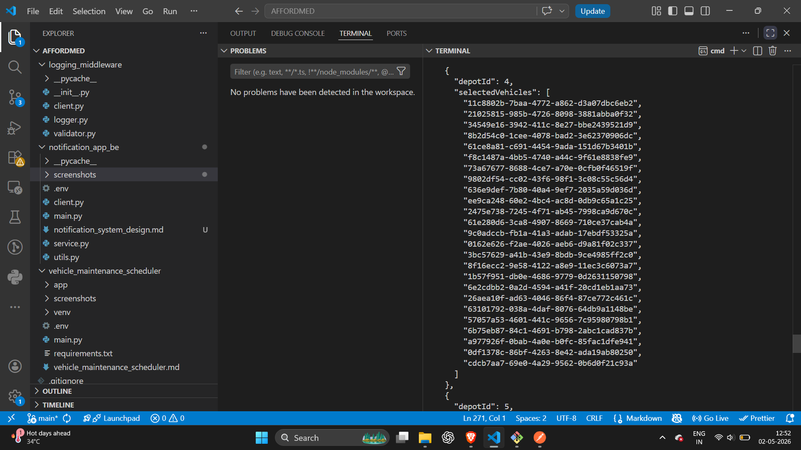
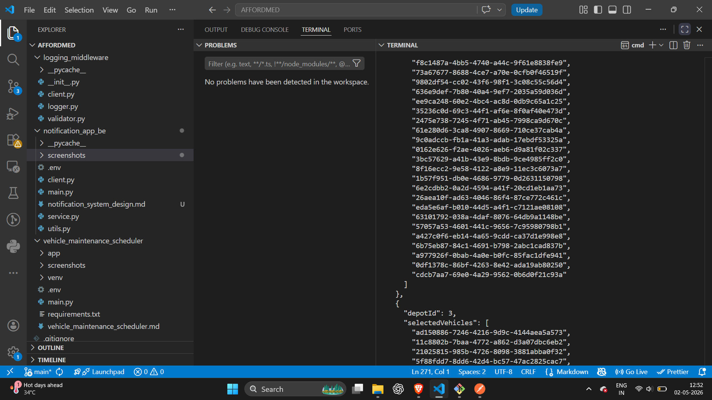

# 🚗 Vehicle Maintenance Scheduler

## 📌 Problem Overview

The goal is to schedule vehicle maintenance tasks across depots such that:

* Total maintenance time does not exceed available mechanic hours
* Overall impact is maximized

---

## 🧠 Approach

* Modeled the problem as a **0/1 Knapsack problem**

  * `Duration` → weight
  * `Impact` → value
  * `MechanicHours` → capacity

* For each depot:

  * Applied dynamic programming (DP)
  * Selected optimal subset of vehicles
  * Ensured total duration ≤ capacity

---

## ⚙️ Features

* Fetches data from external APIs using **Bearer authentication**
* Implements **modular architecture**
* Uses **reusable logging middleware**
* Validates constraints after selection
* Produces clean and structured JSON output

---

## 🪵 Logging System

* Centralized logging module
* Sends logs to external logging API
* Includes:

  * stack
  * level
  * package
  * message
* Implements **fail-safe (non-blocking)** logging

---

## 🧱 Project Structure

```
mainrepo/
│
├── logger_folder/
│   ├── logger.py
│   ├── validator.py
│   ├── client.py
│
├── proj1/
│   ├── app/
│   │   ├── client.py
│   │   ├── service.py
│   │
│   ├── main.py
│   ├── requirements.txt
│   ├── .env
│   ├── screenshots/
│   │   ├── depots.png
│   │   ├── vehicles.png
│   │   ├── logs.png
│   │   ├── auth.png
```

---

## 🔐 Environment Setup

Create a `.env` file inside `proj1/`:

```
AUTH_TOKEN=your_token_here
```

Install dependencies:

```
pip install -r requirements.txt
```

Run the project:

```
python main.py
```

---

## 📸 API Testing (Postman Screenshots)

### 1. Authentication (Token Generation)



---

### 2. GET Depots API

* Endpoint: `/depots`
* Method: GET



---

### 3. GET Vehicles API

* Endpoint: `/vehicles`
* Method: GET



---

### 4. POST Logging API

* Endpoint: `/logs`
* Method: POST

Sample Payload:

```json
{
  "stack": "backend",
  "level": "info",
  "package": "service",
  "message": "Test log from Postman"
}
```



---

## ✅ Output Example

```json
[
  {
    "depotId": 2,
    "selectedVehicles": ["id1", "id2"]
  }
]
```

---

## 📊 Key Considerations

* Ensured **capacity constraints are strictly followed**
* Logging does not affect main execution flow
* API failures handled gracefully

---

## 🛠 Tech Stack

* Python
* Requests
* python-dotenv

---

## 🚀 Summary

This solution demonstrates:

* Strong understanding of **DSA (Knapsack)**
* Clean **backend architecture**
* Proper **API integration**
* Reliable **logging system**

## 📸 Final Output

### Optimized Vehicle Selection Result

* Vehicles selected based on maximum impact
* Total duration constrained by depot capacity





